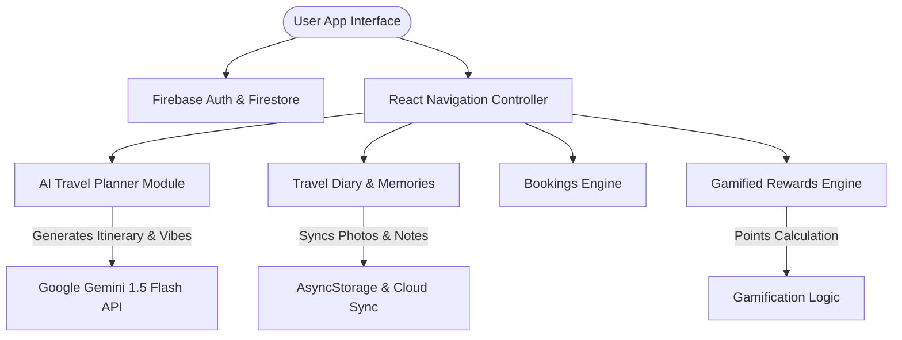

# Travel Saathi ✈️🧳

[](https://docs.expo.dev/)
[](https://reactnative.dev/)
[](https://ai.google.dev/)
[](https://firebase.google.com/)
[](LICENSE)

**Travel Saathi** is an AI-powered smart travel companion and itinerary planner built with **React Native** and **Expo**. Engineered with a calming, modern UI architecture, dynamic dark mode, and haptic feedback, Travel Saathi helps users explore global destinations, log travel memories, track expenses, and earn gamified rewards.

---

## 🌟 Architecture & Data Flow



---

## Key Features

- **Live AI Itinerary Planner**: Powered by **Google Gemini API**, offering real-time destination summaries, top attractions, vibe checks, and budget estimations.
- **Travel Diary & Expense Tracking**: Document trip logs, record spending, and attach travel photos securely.
- **Gamified Rewards Program**: Earn travel points through diary entries and photo logs to unlock tier rewards (mock flight vouchers, lounge access, hotel upgrades).
- **Multi-Category Bookings Portal**: Sleek segmented interface for exploring Hotels, Flights, Trains, and Buses.
- **Modern UI & Theme System**: Dark mode support, glassmorphism card layouts, and tactile haptic feedback.
- **Secure Authentication**: Firebase user signup, login, and unique username validation.

---

## 📁 Repository Structure

```text
Travel_saathi/
├── assets/                 # App icons, splash screens, and images
├── src/
│   ├── components/         # Reusable UI components & custom cards
│   ├── context/            # Global state context (Theme, Auth, Points)
│   ├── navigation/         # React Navigation stacks & tab bar
│   ├── screens/            # Core app screens (Home, Planner, Diary, Rewards)
│   ├── services/           # External API services (Gemini, Firebase)
│   └── utils/              # Helper utilities & constants
├── .github/
│   └── workflows/ci.yml    # GitHub Actions Continuous Integration pipeline
├── App.js                  # App root entry point
├── app.json                # Expo configuration manifest
└── package.json            # Dependencies and scripts
```

---

## 🚀 Getting Started

### Prerequisites
- **Node.js**: v18.0.0 or higher
- **Expo CLI**: `npm install -g expo-cli`
- **Google Gemini API Key**: [Get API Key](https://aistudio.google.com/)
- **Firebase Project**: Configured for Authentication & Firestore

### Installation

1. **Clone the repository**
   ```bash
   git clone https://github.com/MandeepYadav26/Travel_Saathi.git
   cd Travel_Saathi
   ```

2. **Install dependencies**
   ```bash
   npm install
   ```

3. **Configure Environment Variables**
   Create a `.env` file in the root directory:
   ```env
   EXPO_PUBLIC_GEMINI_API_KEY=your_gemini_api_key_here
   ```

4. **Launch Development Server**
   ```bash
   npx expo start
   ```

5. **Run on Device / Emulator**
   - Press `a` for Android Emulator
   - Press `i` for iOS Simulator
   - Scan QR code using **Expo Go** app on physical device

---

## 🛠️ Tech Stack & Libraries

- **Core Framework**: React Native 0.83, Expo SDK 55
- **Navigation**: `@react-navigation/native` & `@react-navigation/bottom-tabs`
- **Artificial Intelligence**: `@google/generative-ai` (Gemini 1.5 Flash)
- **Backend & Auth**: Firebase Authentication & Firestore
- **State & Storage**: React Context API & `@react-native-async-storage/async-storage`
- **UI & UX**: Expo Haptics, Expo Image, Expo Linear Gradient, Glass Effect

---

## 🤝 Contributing & Community

Contributions are welcome! Please read [CONTRIBUTING.md](CONTRIBUTING.md) for contribution guidelines, [CODE_OF_CONDUCT.md](CODE_OF_CONDUCT.md) for community standards, and [SECURITY.md](SECURITY.md) for security reporting.

---

## 📄 License

This project is licensed under the MIT License - see the [LICENSE](LICENSE) file for details.